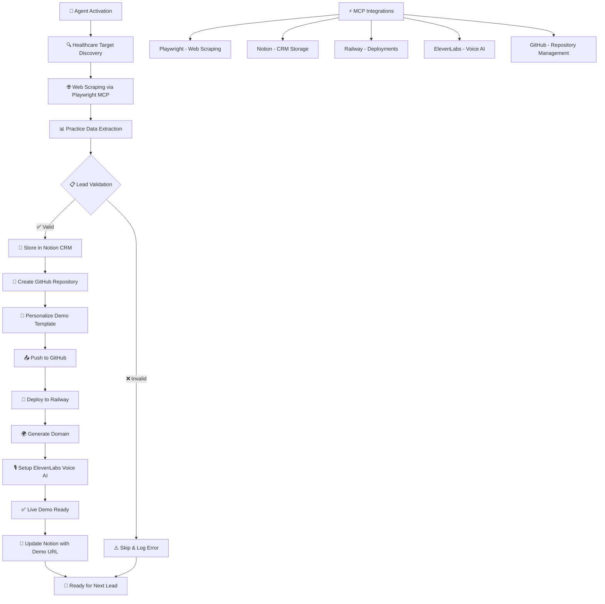

# 🤖 Leadsprint AI Agent

**A fully autonomous Node.js AI agent for healthcare lead generation and automated demo deployment with 24/7 Railway deployment, MCP integration, and complete lead-to-demo pipeline.**

[](https://railway.app/template/your-template-id)
[](https://nodejs.org/)
[](LICENSE)

## 🎯 Overview

This autonomous Leadsprint AI agent provides complete healthcare lead generation automation, from practice discovery to live demo deployment. It operates 24/7 on Railway, using AI-powered decision making and Model Context Protocol (MCP) integrations for seamless healthcare practice automation.

### ✨ Key Features

- **🤖 Fully Autonomous Operation**: Runs 24/7 without human intervention
- **🏥 Healthcare-Focused**: Specialized for medical practice automation
- **⚡ MCP Integration**: Playwright, Notion, Railway, ElevenLabs protocols
- **🧠 AI-Powered Decisions**: Claude & GPT integration for intelligent planning
- **🚂 Railway Deployment**: Optimized for Railway platform with auto-scaling
- **📊 Complete Pipeline**: Lead discovery → Demo deployment → Voice agents
- **🔒 Security First**: Domain whitelisting, rate limiting, content validation
- **📈 Self-Healing**: Automatic error recovery and system monitoring

## 🏗️ Architecture



### 📁 Project Structure

```
autonomous-healthcare-agent/
├── src/
│   ├── index.js                 # Main agent orchestrator
│   ├── planner.js              # AI decision engine
│   ├── executor.js             # MCP action executor
│   ├── scheduler.js            # Task scheduling system
│   ├── db.js                   # Database abstraction
│   ├── healthcare-agent.js     # Healthcare workflow
│   ├── mcp-client.js          # MCP protocol client
│   ├── mcp/
│   │   ├── mcpClient.js       # Main MCP client implementation
│   │   └── mcpConfigs.js      # MCP provider configurations
│   └── utils/
│       ├── logger.js           # Winston logging
│       ├── healthcare-utils.js # Healthcare utilities
│       ├── config-manager.js   # Configuration system
│       └── security-whitelist.js # Security validation
├── config/
│   ├── settings.json           # Main configuration
│   └── security.json          # Security settings
├── Dockerfile                  # Multi-stage Docker build
├── railway.toml               # Railway deployment config
├── package.json               # Node.js dependencies
└── README.md                  # This file
```

## 🚀 Quick Deploy to Railway

### One-Click Deployment

[](https://railway.app/template/your-template-id)

### Manual Railway Deployment

1. **Clone and Push to GitHub**:
   ```bash
   git clone <your-repo>
   cd autonomous-healthcare-agent
   git push origin main
   ```

2. **Deploy to Railway**:
   - Visit [railway.app](https://railway.app)
   - Connect your GitHub repository
   - Railway will automatically detect the `railway.toml` and deploy

3. **Set Environment Variables** in Railway Dashboard:
   ```env
   # Required API Keys
   ANTHROPIC_API_KEY=your_claude_key
   OPENAI_API_KEY=your_openai_key
   NOTION_API_KEY=your_notion_key
   ELEVENLABS_API_KEY=your_elevenlabs_key
   RAILWAY_API_TOKEN=your_railway_token
   
   # Healthcare Configuration
   NOTION_DATABASE_ID=your_notion_db_id
   HEALTHCARE_AUTO_DEPLOY=true
   
   # Security Settings
   ENABLE_SECURITY_HEADERS=true
   MAX_REQUESTS_PER_HOUR=1000
   ```

## 🔧 Local Development

### Prerequisites

- Node.js 20+
- npm or yarn
- Git

### Installation

1. **Clone the Repository**:
   ```bash
   git clone <repository-url>
   cd autonomous-healthcare-agent
   ```

2. **Install Dependencies**:
   ```bash
   npm install
   ```

3. **Environment Configuration**:
   ```bash
   cp .env.example .env
   # Edit .env with your API keys
   ```

4. **Start Development Server**:
   ```bash
   npm run dev
   ```

### Development Commands

```bash
# Start with hot reload
npm run dev

# Start production mode
npm start

# Run tests
npm test

# Lint code
npm run lint

# Build Docker image
docker build -t healthcare-agent .

# Run with Docker
docker run -p 3000:3000 healthcare-agent
```

## ⚙️ Configuration

### Environment Variables

| Variable | Required | Description | Default |
|----------|----------|-------------|---------|
| `NODE_ENV` | No | Environment mode | `development` |
| `PORT` | No | Server port | `3000` |
| `LOG_LEVEL` | No | Logging level | `info` |
| `DB_TYPE` | No | Database type | `sqlite` |
| `DATABASE_URL` | No | Database connection | SQLite file |
| `ANTHROPIC_API_KEY` | Yes | Claude API key | - |
| `OPENAI_API_KEY` | No | OpenAI API key | - |
| `NOTION_API_KEY` | Yes | Notion API key | - |
| `ELEVENLABS_API_KEY` | Yes | ElevenLabs API key | - |
| `RAILWAY_API_TOKEN` | Yes | Railway API token | - |

### Healthcare Configuration

The agent can be configured via `config/settings.json`:

```json
{
  "agent": {
    "name": "Healthcare Automation Agent",
    "maxConcurrentTasks": 3,
    "taskTimeout": 300000
  },
  "healthcare": {
    "discoveryTargets": [
      "https://www.theprivateclinic.co.uk",
      "https://www.111harleystreet.com"
    ],
    "practiceTypes": ["beauty", "dental", "chiropractic"],
    "leadScoring": {
      "minScore": 50,
      "highPriorityThreshold": 80
    }
  }
}
```

## 🤖 Healthcare Automation Workflow

The agent follows this automated workflow:

### 1. 🔍 Lead Discovery
- Scrapes healthcare practice websites
- Extracts contact information and services
- Calculates lead scores based on practice type and quality

### 2. 📊 Lead Storage
- Stores leads in Notion database
- Tracks processing status and metadata
- Prioritizes high-value practices

### 3. 🏗️ Repository Creation
- Creates personalized GitHub repositories
- Customizes healthcare demo templates
- Applies practice-specific branding

### 4. 🚂 Railway Deployment
- Deploys personalized demos to Railway
- Sets up environment variables
- Configures custom domains

### 5. 🎤 Voice Agent Setup
- Creates ElevenLabs voice agents
- Generates practice-specific prompts
- Configures appointment scheduling

### 6. 📈 Monitoring & Recovery
- Monitors deployment health
- Automatically recovers from failures
- Collects performance metrics

## 🔌 MCP Integration

### Supported Providers

The agent integrates with multiple MCP providers through the unified MCP client:

- **🎭 Playwright MCP**: Web scraping and browser automation for healthcare websites
- **📊 Notion MCP**: Database and lead management with healthcare-specific schemas
- **🚂 Railway MCP**: Deployment automation and project management
- **🎤 ElevenLabs MCP**: Voice synthesis and audio content generation

### MCP Configuration

The MCP system is configured through `src/mcp/mcpConfigs.js` with healthcare-specific settings:

```javascript
// Healthcare-specific MCP configurations
const healthcareConfigs = {
  playwright: {
    targetDomains: ['fysiotherapie-amsterdam.nl', 'massagepraktijk-amsterdam.nl'],
    practicePatterns: {
      fysiotherapie: ['fysio', 'fysiotherapie', 'physiotherapy'],
      massage: ['massage', 'massagetherapie', 'massagepraktijk']
    }
  },
  notion: {
    databases: {
      leads: {
        properties: {
          name: { type: 'title' },
          type: { type: 'select', options: ['Fysiotherapie', 'Massage', 'Kliniek'] },
          status: { type: 'select', options: ['New', 'Contacted', 'Demo Deployed'] }
        }
      }
    }
  }
};
```

### MCP Client Usage

The MCP client provides a unified interface for all healthcare operations:

```javascript
import { mcpClient } from './src/mcp/mcpClient.js';

// Execute healthcare-specific MCP actions
async function processHealthcareLead(leadData) {
  // Scrape healthcare practice website
  const scrapedData = await mcpClient.executeHealthcareAction(
    'playwright', 
    'scrapeHealthcareWebsite', 
    { url: leadData.website, practiceType: leadData.type }
  );
  
  // Store lead in Notion
  await mcpClient.executeHealthcareAction(
    'notion', 
    'saveLeadToNotion', 
    { leadData: { ...scrapedData, ...leadData } }
  );
  
  // Deploy healthcare demo
  const deployment = await mcpClient.executeHealthcareAction(
    'railway', 
    'deployHealthcareDemo', 
    { practiceName: leadData.name, template: 'standard' }
  );
  
  return deployment;
}
```

### Custom MCP Actions

The system supports healthcare-specific MCP actions:

```javascript
// Playwright MCP Actions
await mcpClient.makeRequest('playwright', 'scrapeHealthcareWebsite', {
  url: 'https://example-fysiotherapie.nl',
  practiceType: 'fysiotherapie',
  extractContact: true,
  extractServices: true,
  screenshot: true
});

// Notion MCP Actions
await mcpClient.makeRequest('notion', 'saveLeadToNotion', {
  leadData: {
    name: 'Fysiotherapie Amsterdam',
    type: 'Fysiotherapie',
    phone: '+31201234567',
    email: 'info@fysioamsterdam.nl',
    website: 'https://fysioamsterdam.nl'
  }
});

// Railway MCP Actions
await mcpClient.makeRequest('railway', 'deployHealthcareDemo', {
  practiceName: 'Fysiotherapie Amsterdam',
  template: 'standard',
  customConfig: {
    theme: 'healthcare-blue',
    contactForm: true,
    locationMap: true
  }
});

// ElevenLabs MCP Actions
await mcpClient.makeRequest('elevenlabs', 'synthesizePracticeIntro', {
  practiceName: 'Fysiotherapie Amsterdam',
  specialization: 'Fysiotherapie en Manuele Therapie',
  location: 'Amsterdam Centrum',
  contactInfo: {
    phone: '+31201234567',
    email: 'info@fysioamsterdam.nl'
  }
});
```

### MCP Health Monitoring

The MCP client includes comprehensive health monitoring:

```javascript
// Check provider health
const healthStatus = mcpClient.getAllProviderStatuses();
console.log('MCP Provider Health:', healthStatus);

// Get request statistics
const stats = mcpClient.getRequestStats();
console.log('MCP Request Stats:', stats);

// Monitor active requests
const activeRequests = mcpClient.getActiveRequests();
console.log('Active Requests:', activeRequests);
```

## 📊 Monitoring & Logging

### Health Endpoints

- `GET /health` - System health check
- `GET /metrics` - Prometheus metrics
- `GET /status` - Detailed system status

### Logging

Structured JSON logging with multiple levels:

```javascript
logger.healthcare.leadProcessed(leadData);
logger.healthcare.deploymentStarted(deploymentData);
logger.healthcare.deploymentCompleted(deploymentData);
logger.mcp.requestCompleted(requestData);
logger.mcp.requestFailed(requestData, error);
```

### Database Schema

The agent maintains comprehensive tracking:

- **Leads**: Practice information and processing status
- **MCP Executions**: All MCP action logs and results
- **Task Executions**: Scheduled task history
- **System Events**: Health and performance metrics

## 🔒 Security Features

### Domain Whitelisting

Strict domain validation for healthcare practices:

```javascript
// Allowed healthcare domains
const allowedDomains = [
  'theprivateclinic.co.uk',
  '111harleystreet.com',
  'harleystreetskinclinic.com',
  '*.clinic',
  '*.medical'
];
```

### Rate Limiting

- 1000 requests per hour per IP
- Graduated penalties for violations
- Automatic recovery after cooldown

### Content Validation

- Malicious pattern detection
- Healthcare content scoring
- Input sanitization and validation

## 🚀 Deployment Options

### Railway (Recommended)

Railway provides the best experience with:
- Automatic scaling
- Built-in monitoring
- Easy environment management
- Git-based deployments

### Docker Deployment

```bash
# Build image
docker build -t healthcare-agent .

# Run container
docker run -d \
  --name healthcare-agent \
  -p 3000:3000 \
  -e ANTHROPIC_API_KEY=your_key \
  healthcare-agent
```

### Manual Deployment

```bash
# Install dependencies
npm ci --production

# Start with PM2
pm2 start src/index.js --name healthcare-agent

# Monitor
pm2 logs healthcare-agent
pm2 monit
```

## 📈 Performance Optimization

### Autonomous Operation

The agent is designed for 24/7 autonomous operation:

- **Self-healing**: Automatic error recovery
- **Load balancing**: Request distribution
- **Resource management**: Memory and CPU optimization
- **Graceful degradation**: Continues operating during partial failures

### Scaling Considerations

- **Horizontal scaling**: Multiple agent instances
- **Database optimization**: Connection pooling and indexing
- **MCP rate limiting**: Prevents API throttling
- **Caching strategies**: Configuration and validation caching

## 🧪 Testing

### Unit Tests

```bash
npm test
```

### Integration Tests

```bash
npm run test:integration
```

### Load Testing

```bash
npm run test:load
```

### Healthcare Workflow Testing

Test the complete automation pipeline:

```bash
# Test lead discovery
npm run test:discovery

# Test deployment pipeline
npm run test:deployment

# Test voice agent creation
npm run test:voice-agents

# Test MCP integrations
npm run test:mcp
```

## 🐛 Troubleshooting

### Common Issues

1. **Railway Deployment Fails**
   ```bash
   # Check logs
   railway logs
   
   # Verify environment variables
   railway variables
   
   # Redeploy
   railway up
   ```

2. **MCP Connection Errors**
   ```bash
   # Check API keys
   echo $ANTHROPIC_API_KEY
   
   # Test connectivity
   npm run test:mcp
   
   # Check MCP provider status
   curl http://localhost:3000/api/mcp/status
   ```

3. **Database Issues**
   ```bash
   # Reset database
   rm data/healthcare_agent.db
   npm start
   ```

### Debug Mode

Enable detailed logging:

```bash
LOG_LEVEL=debug npm start
```

### Health Check Failures

Monitor system health:

```bash
curl http://localhost:3000/health
curl http://localhost:3000/status
curl http://localhost:3000/api/mcp/status
```

## 🤝 Contributing

1. Fork the repository
2. Create a feature branch (`git checkout -b feature/amazing-feature`)
3. Commit changes (`git commit -m 'Add amazing feature'`)
4. Push to branch (`git push origin feature/amazing-feature`)
5. Open a Pull Request

### Development Guidelines

- Follow ESLint configuration
- Add tests for new features
- Update documentation
- Maintain healthcare focus
- Ensure security compliance
- Follow MCP integration patterns

## 📄 License

This project is licensed under the MIT License - see the [LICENSE](LICENSE) file for details.

## 🆘 Support

- **Issues**: [GitHub Issues](https://github.com/your-repo/issues)
- **Discussions**: [GitHub Discussions](https://github.com/your-repo/discussions)
- **Email**: support@your-domain.com

## 🙏 Acknowledgments

- **Railway** for excellent deployment platform
- **Anthropic** for Claude AI integration
- **Model Context Protocol** for standardized agent communication
- **Healthcare community** for inspiration and requirements

---

## 📋 Quick Reference

### Essential Commands

```bash
# Quick start
npm install && npm start

# Deploy to Railway
railway up

# Check health
curl /health

# View logs
tail -f logs/agent.log

# Stop gracefully
npm run stop
```

### API Endpoints

- `POST /webhook` - Webhook for external triggers
- `GET /health` - Health check
- `GET /metrics` - System metrics
- `GET /status` - Detailed status
- `GET /stats` - Performance statistics
- `GET /api/mcp/status` - MCP provider status
- `GET /api/mcp/providers` - List all MCP providers

### Configuration Files

- `config/settings.json` - Main configuration
- `config/security.json` - Security settings
- `.env` - Environment variables
- `railway.toml` - Railway deployment config
- `Dockerfile` - Container definition
- `src/mcp/mcpConfigs.js` - MCP provider configurations

### MCP Provider URLs

- **Playwright MCP**: `http://localhost:8080`
- **Notion MCP**: `http://localhost:8081`
- **Railway MCP**: `http://localhost:8082`
- **ElevenLabs MCP**: `http://localhost:8083`

Built with ❤️ for autonomous healthcare automation.
